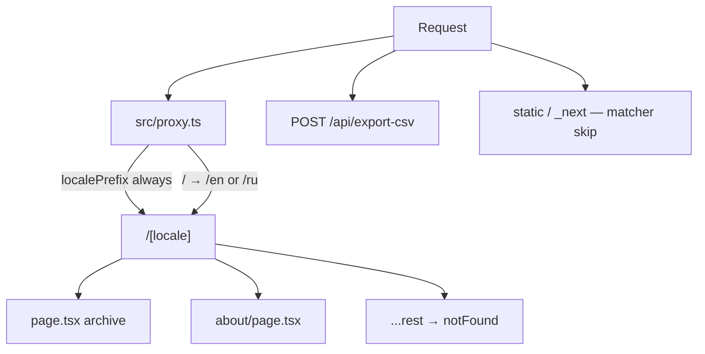
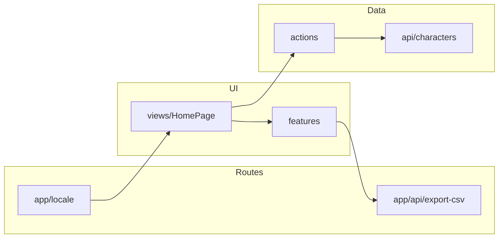

# Hogwarts Archive

**Language:** [English](README.md) | [Русский](README_ru.md)

A Harry Potter character archive: search by name, pagination, a details card, multi-select, and CSV export. The UI is English and Russian, with light and dark themes.

[](https://github.com/theFoxTale/hogwarts-archive)
[](https://gitverse.ru/theFoxTale/hogwarts-archive)
[](https://nextjs.org/)
[](https://react.dev/)
[](https://www.typescriptlang.org/)

The project started as [RS School React](https://rs.school/react/) coursework (modules 01–06) and continues as a Next.js App Router pet project.

## Stack

- **Next.js 16** (App Router, Server Components, Server Actions)
- **React 19** / **TypeScript**
- **next-intl** — `en` and `ru` in the URL (`/en`, `/ru/about`)
- **Redux Toolkit** — selected characters only (checkboxes / flyout)
- **Context API** — light/dark theme (`data-theme` on `<html>`)
- **Vitest** + Testing Library — unit / integration tests
- **ESLint**, **Prettier**, **Husky** + **lint-staged**

PotterDB is read through one layer: `src/api/characters.ts` → thin Server Actions in `src/actions/characters.ts`. There is no RTK Query in the app.

## Run

```bash
npm install
npm run dev
```

Open [http://localhost:3000](http://localhost:3000) — the next-intl proxy redirects to `/en` (or `/ru` from the browser language / cookie).

| Command                 | Description                         |
| ----------------------- | ----------------------------------- |
| `npm run dev`           | Next.js dev server                  |
| `npm run build`         | Production build                    |
| `npm start`             | Run the production build            |
| `npm run lint`          | ESLint                              |
| `npm run format:fix`    | Prettier across the repo            |
| `npm run type-check`    | `tsc --noEmit`                      |
| `npm test`              | Vitest (watch in a TTY)             |
| `npm run test:watch`    | Vitest interactive watch            |
| `npm run test:coverage` | `vitest run` with a coverage report |
| `npm run prepare`       | Install Husky (after `npm install`) |

Hooks:

- **pre-commit** — `lint-staged` (Prettier + ESLint on staged files)
- **pre-push** — `npm run lint` and `npm run type-check`

## Routes

| URL                    | What it is                                 |
| ---------------------- | ------------------------------------------ |
| `/`                    | redirect to `/en` or `/ru`                 |
| `/en`, `/ru`           | archive: search, list, details, pagination |
| `/en/about`            | about the app                              |
| `POST /api/export-csv` | CSV of selected characters                 |

Search and page live in the query: `?q=Harry&page=2&characterId=<id>`. The first archive render happens on the server via `searchCharactersAction`.

Switching language changes the path prefix and keeps the current page (`/en/about` → `/ru/about`).



More detail: [docs/architecture.md](docs/architecture.md).

## `src/` layout

```
src/
  app/                 # App Router: thin route files
    layout.tsx
    [locale]/          # pages with locale in the URL
    api/export-csv/
  proxy.ts             # next-intl: locale prefix and redirects
  actions/             # 'use server' — wrappers over the API
  api/                 # fetch PotterDB, mapping, optional mock
  providers/           # Redux + theme
  components/
    ui/                # buttons, frames, flag, checkbox
    layout/            # header, pagination
    features/          # search, results, details, flyout, flags
    views/             # HomePage (client composite screen)
  store/               # selectedItems
  contexts/theme/
  i18n/                # routing, navigation, request config
  test/
```

How it connects at runtime:



Translations: `messages/en.json`, `messages/ru.json`. Static files: `public/`. Course history and mockups: `docs/`. Architecture diagrams: [docs/architecture.md](docs/architecture.md).

Aliases: `@/*` → `src/*`, plus barrels `@ui`, `@layout`, `@features`, `@views`, `@api`, `@store`, `@contexts`.

## API

Public [PotterDB](https://docs.potterdb.com/), base URL: `https://api.potterdb.com/v1/characters`.

- Search: `filter[name_cont]=<string>`
- Pagination: `page[number]`, `page[size]` (page size in the app is **3**)
- Details: `GET /v1/characters/:id`

Example:

```http
GET https://api.potterdb.com/v1/characters?filter[name_cont]=Harry&page[number]=1&page[size]=3
```

- [List (page 1)](https://api.potterdb.com/v1/characters)
- [Character by ID](https://api.potterdb.com/v1/characters/6ce92f2b-2bca-49e6-a696-ddde6f555066)

Local mock without the network — in `.env` (see `.env.example`):

```
NEXT_PUBLIC_USE_MOCK_API=true
NEXT_PUBLIC_MOCK_DELAY_MS=0
```

## Tests

```bash
npm test
npm run test:coverage
```

Thresholds in `vitest.config.ts`: statements **80%**, branches / functions / lines **50%**.
