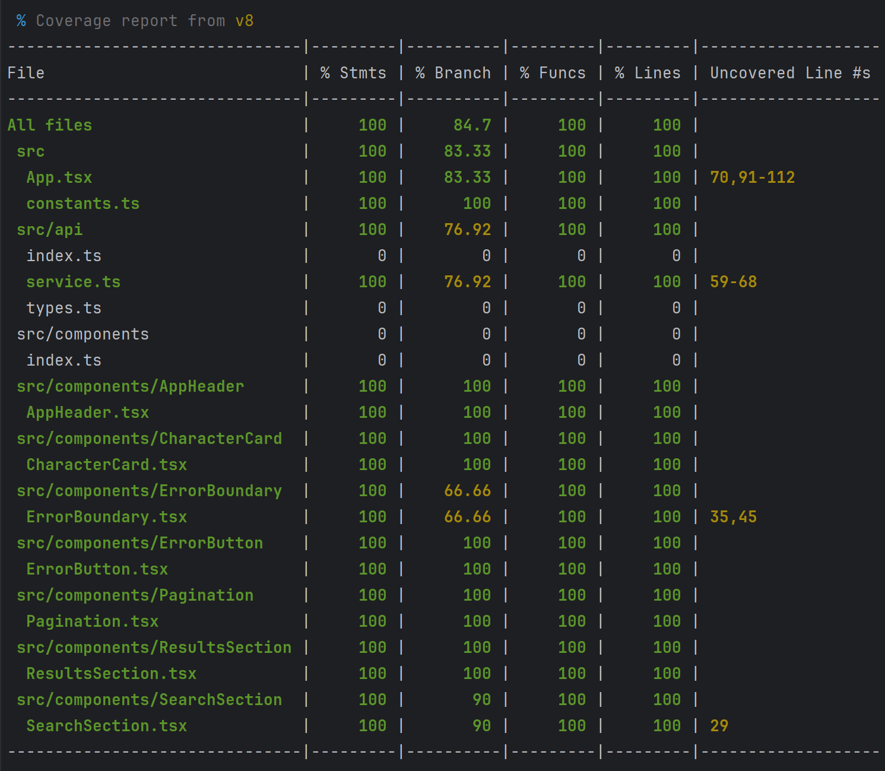

## Отчёт по unit-тестированию (React Class Components)

### Функциональные требования (100/100)

#### 1. Test Coverage (+14)

- [x] **(+14)** Statement coverage ≥80%, branch, function, line coverage ≥50% (подтверждено отчётом).  
      `statements: 100%, branches: 84.7%, functions: 100%, lines: 100%`

#### 2. No Functional Changes (+14)

- [x] **(+14)** Логика классовых компонентов не изменена. Добавлены только `data-testid` для удобства тестирования, конвертация в функциональные компоненты не производилась.

#### 3. Behavior-Focused Testing (+14)

- [x] **(+14)** Тесты проверяют рендер, пользовательские события, колбэки и состояние UI. Внутренние детали (lifecycle, state) не тестируются напрямую.

#### 4. API Mocking (+14)

- [x] **(+14)** Все вызовы `fetch` замоканы через `vi.mock('./api/service')`. Реальные сетевые запросы отсутствуют. Протестированы успешные и ошибочные ответы API.

#### 5. Error Handling (+14)

- [x] **(+14)** Протестированы сценарии: ошибка API, выброс ошибки в `ResultsSection` по кнопке, работа `ErrorBoundary` (fallback UI, логирование в консоль, кнопка «Try again»).

#### 6. User Interactions (+14)

- [x] **(+14)** Протестированы: ввод текста в поиск, клик по кнопке Search, нажатие Enter, очистка поля, пагинация (Previous/Next). Обработаны пограничные случаи (пустой ввод, лишние пробелы, повторный поиск с тем же термином).

#### 7. LocalStorage Functionality Testing (+16)

- [x] **(+16)** Протестировано: чтение сохранённого поискового термина и номера страницы при монтировании, запись новых значений после поиска и пагинации. Проведены тесты для случаев, когда `localStorage` пуст, содержит значение, перезаписывается.

---

### Технические требования (штрафы)

- [x] **(-0)** Отсутствие функциональных требований исходного приложения – не выявлено (все реализовано в предыдущем PR).
- [x] **(-0)** TypeScript используется, `any` и `ts-ignore` отсутствуют.
- [x] **(-0)** Code-smells – отсутствуют.
- [x] **(-0)** Покрытие соответствует порогам (statements 100%).
- [x] **(-0)** Нет прямых DOM-манипуляций.
- [x] **(-0)** Сторонние UI-библиотеки не используются.
- [x] **(-0)** Коммиты в рамках дедлайна.
- [x] **(-0)** PR соответствует гайдлайну (чекбоксы, описание).
- [x] **(-0)** Ветка `unit-testing` создана от `class-components`, файлы конфигурации тестов добавлены в эту ветку.

---

### Сценарии тестирования (выполненные тесты)

#### 1. SearchSection (компонент поиска)

- **Рендер** – отображает поле ввода и кнопку поиска.
- **Отображение сохранённого термина** – при передаче `initialSearchText` поле заполняется корректно.
- **Ввод пользователя** – при вводе текста значение поля обновляется.
- **Поиск по клику** – вызывается `onSearch` с обрезанным значением (удаляются пробелы).
- **Поиск по Enter** – вызов `onSearch` при нажатии клавиши Enter.
- **Очистка поля** – кнопка «✖» очищает поле и вызывает `onSearch('')`.

#### 2. ResultsSection / CharacterCard

- **Индикатор загрузки** – отображается при `isLoading={true}`.
- **Сообщение об ошибке** – показывается текст ошибки из пропса `error`.
- **Пустые результаты** – вывод сообщения "No characters found".
- **Список персонажей** – при наличии данных рендерятся карточки с именем, домом, видом, полом.
- **Отсутствующие поля** – если какое-то поле (house, gender) равно null, соответствующий блок не отображается.
- **Изображение** – если `image` не указан, используется заглушка `anonymous.jpg`; кастомное изображение подставляется корректно; при ошибке загрузки изображения подставляется заглушка.
- **Генерация ошибки** – при изменении `shouldThrowError` с false на true компонент выбрасывает ошибку (проверяется с `ErrorBoundary`).

#### 3. Pagination

- **Отображение текущей страницы** – текст "Page X of Y".
- **Блокировка кнопки Previous** – при `isPrevAvailable={false}` кнопка недоступна.
- **Навигация назад** – клик по Previous вызывает `onPrev`.
- **Навигация вперёд** – клик по Next вызывает `onNext`.

#### 4. ErrorBoundary

- **Fallback UI** – при ошибке в дочернем компоненте отображается заголовок "Something went wrong" и сообщение об ошибке.
- **Логирование в консоль** – `console.error` вызывается с деталями ошибки.
- **Кнопка "Try again"** – вызывает переданный `onReset`.

#### 5. ErrorButton (FloatingErrorButton)

- **Рендер кнопки** – кнопка присутствует в DOM.
- **Симуляция ошибки** – по клику вызывается `onSimulateError`.

#### 6. App (интеграционные сценарии)

- **Загрузка начальных данных без сохранённого поиска** – при пустом `localStorage` отправляется запрос с пустой строкой и страницей 1.
- **Восстановление поискового термина** – если в `localStorage` есть `SEARCH_TEXT`, он подставляется в поле и используется в запросе.
- **Восстановление номера страницы** – при загрузке восстанавливается и номер страницы.
- **Выполнение поиска** – по клику на "Search" отправляется запрос с обрезанным термином, данные сохраняются в `localStorage`, страница сбрасывается на 1.
- **Защита от повторных запросов** – при повторном нажатии с тем же термином новый запрос не отправляется.
- **Обработка ошибки API** – при ошибке запроса отображается сообщение "Network error".
- **Пагинация (Next / Previous)** – переход на следующую/предыдущую страницу, сохранение номера страницы в `localStorage`.
- **Сброс страницы при новом поиске** – если пользователь выполняет поиск с другой страницы, номер страницы сбрасывается на 1.
- **Клик по кнопке ошибки** – переводит приложение в состояние ошибки, перехватываемое `ErrorBoundary` с отображением fallback; после нажатия «Try again» состояние восстанавливается.

#### 7. API mocking и service (unit-тесты для `service.ts`)

- **Формирование URL с параметрами** – корректное кодирование `filter[name_cont]`, `page[number]`, `page[size]`.
- **Обработка пустого поискового термина** – отсутствие параметра `filter`.
- **Парсинг успешного ответа** – преобразование `data` в массив объектов `Character`.
- **Отсутствие данных** – возврат пустого массива и `null` для пагинации.
- **Ошибки HTTP** – 404, 5xx, 4xx – выбрасываются соответствующие сообщения.

#### 8. LocalStorage

- **Чтение при монтировании** – `getItem` вызывается для ключей `SEARCH_TEXT` и `SEARCH_PAGE`.
- **Запись после поиска** – `setItem` вызывается с новым значением для `SEARCH_TEXT` и `SEARCH_PAGE` (сбрасывается на 1).
- **Запись после пагинации** – `setItem` вызывается для `SEARCH_PAGE` с новым номером.
- **Перезапись значения** – повторный поиск обновляет существующую запись.

#### 9. Покрытие (итоговое)

- **Statements:** 100%
- **Branches:** 84.7%
- **Functions:** 100%
- **Lines:** 100%

---

### Дополнительные проверки (выполнено)

- [x] Все тесты проходят: `npm run test` → ✅ 48 passed, 0 failed.
- [x] Настроен Husky pre-push hook: перед отправкой автоматически запускаются тесты.
- [x] В `vitest.config.ts` заданы пороги покрытия (`thresholds`).
- [x] Отчёт о покрытии прикреплён к PR (скриншот test-coverage.png).
