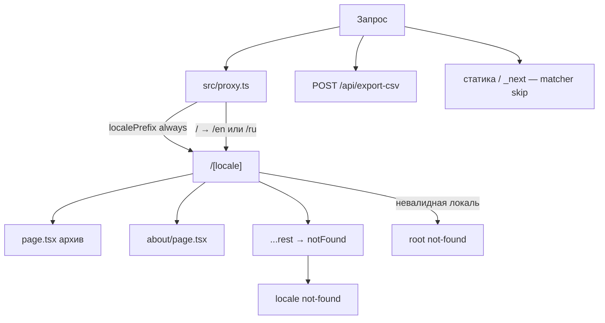
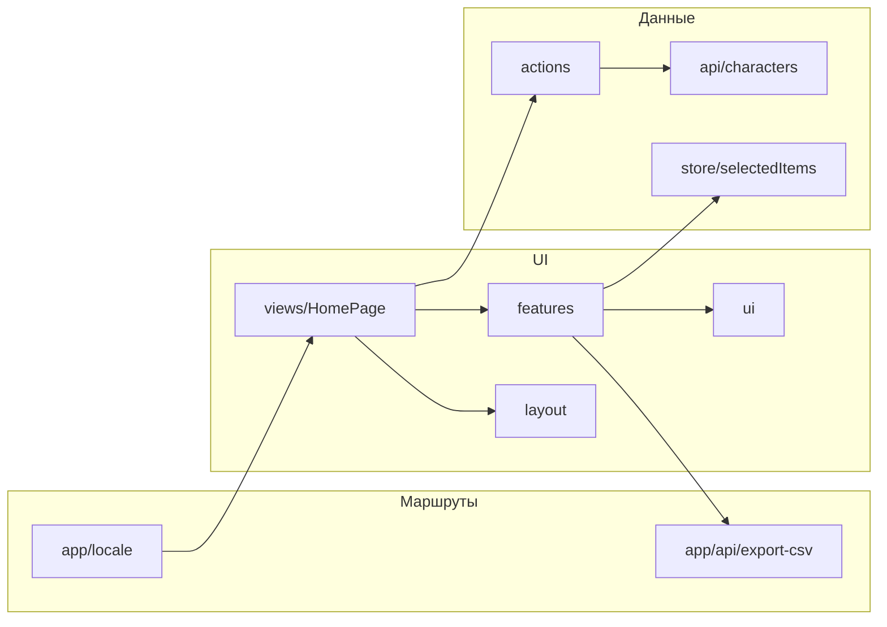
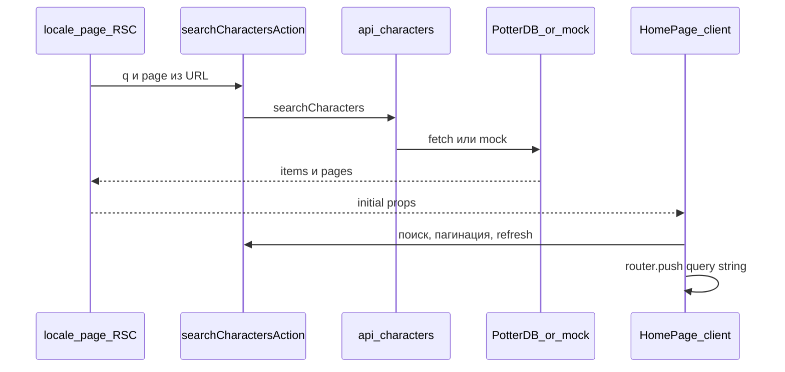
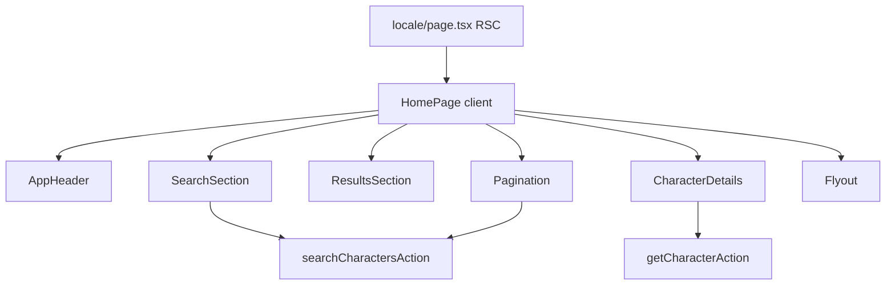
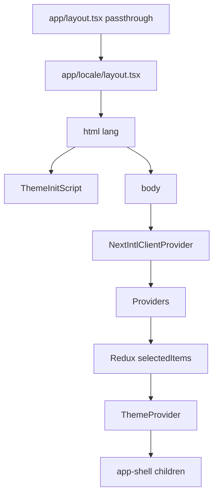
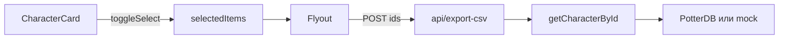
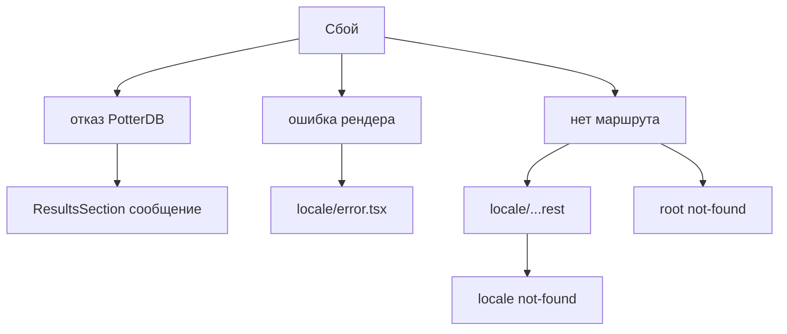

# Архитектура Hogwarts Archive

## 1. Маршрутизация

Файл [`src/proxy.ts`](../src/proxy.ts) содержит middleware для интернационализации (next-intl) с префиксом локали, установленным в `always` (т.е. `localePrefix: 'always'`). В настройках `matcher` исключаются пути, начинающиеся с `api`, `_next`, `_vercel`, а также любые пути, содержащие точку (статические файлы). Корневой путь `/` автоматически перенаправляется на `/en` или `/ru` в зависимости от языка браузера или сохранённой cookie.

Страница приложения [`src/app/[locale]/page.tsx`](../src/app/[locale]/page.tsx) считывает параметры запроса: `?q=`, `page=` и `characterId=`. Для смены языка используется флаг, который вызывает `router.replace(pathname, { locale })` и сохраняет текущий путь (например, `/en/about` → `/ru/about`).

Если запрошен неизвестный путь внутри локали, срабатывает [`src/app/[locale]/[...rest]/page.tsx`](../src/app/[locale]/[...rest]/page.tsx), который вызывает `notFound()`, и отображается страница [`src/app/[locale]/not-found.tsx`](../src/app/[locale]/not-found.tsx). При невалидной локали или запросе вне префикса `[locale]` подключается корневая страница 404 — [`src/app/not-found.tsx`](../src/app/not-found.tsx).

## 2. Структура

Файлы в папке `src/app/` выполняют только маршрутизацию и являются лёгкими прослойками — они не содержат бизнес-логики, а лишь делегируют выполнение другим компонентам. Основной экран приложения — это клиентский компонент [`HomePage`](../src/components/views/HomePage/HomePage.tsx). Все функциональные части (поиск, список, детали, нижняя панель) вынесены в папку `features/`. Доступ к данным PotterDB осуществляется исключительно через [`src/api/characters.ts`](../src/api/characters.ts) и серверные действия (Server Actions) в [`src/actions/characters.ts`](../src/actions/characters.ts).

## 3. Поиск и данные

Первоначальная отрисовка приложения происходит на сервере с использованием **React Server Components (RSC)** — это технология, позволяющая рендерить компоненты на сервере и передавать клиенту уже готовый HTML. Подробнее о RSC можно прочитать в [официальной документации React](https://react.dev/reference/rsc/server-components). В нашем случае страница вызывает `searchCharactersAction` и передаёт полученный результат в `HomePage` как начальные пропсы. Все последующие операции — поиск, пагинация и обновление (кнопка refresh) — инициируются с клиента через тот же action, а URL синхронизируется с помощью `router.push`.

Источником данных служит PotterDB либо локальный мок-сервер (в зависимости от переменной окружения `NEXT_PUBLIC_USE_MOCK_API`).

## 4. Клиентская часть

Файл `[locale]/page.tsx` выполняется на сервере. Внутри него используется клиентский компонент [`HomePage`](../src/components/views/HomePage/HomePage.tsx) (`'use client'`), который управляет состоянием результатов, текущей страницей, поисковым запросом, идентификатором выбранного персонажа, а также состояниями загрузки и ошибок. Компоненты поиска, списка результатов, пагинации и нижней панели встроены непосредственно в `HomePage`. Детальная карточка персонажа загружается отдельно через `getCharacterAction`.

## 5. Провайдеры

Корневой макет [`src/app/layout.tsx`](../src/app/layout.tsx) выступает как прослойка и просто возвращает `children` без элементов `<html>`. Полноценный документ собирается в [`src/app/[locale]/layout.tsx`](../src/app/[locale]/layout.tsx): там устанавливается атрибут `lang` для `<html>`, подключается `ThemeInitScript` для задания `data-theme` до начала отрисовки, затем `NextIntlClientProvider` и общий [`Providers`](../src/providers/index.tsx) (который объединяет Redux и провайдер темы).

## 6. Выбор и CSV

Флажки (чекбоксы) при выборе персонажей записывают данные только в Redux-состояние `selectedItems`, не затрагивая кэш персонажей. При смене поискового запроса или страницы автоматически вызывается `clearAll()`. При открытии нижней панели отправляется `POST`-запрос на `/api/export-csv`. Маршрут вызывает `getCharacterById` из [`src/api/characters.ts`](../src/api/characters.ts) — тот же слой, что поиск и детали, включая mock (`NEXT_PUBLIC_USE_MOCK_API`). В CSV есть колонка Wiki (`Character.wiki`).

## 7. Ошибки и 404

Ошибки при обращении к PotterDB (например, недоступность сервиса) перехватываются в `HomePage` через `try/catch`, и в `ResultsSection` отображается соответствующее сообщение. Если ошибка происходит во время рендеринга, срабатывает клиентская страница ошибки [`src/app/[locale]/error.tsx`](../src/app/[locale]/error.tsx), где доступны кнопка сброса и ссылка на главную. Для неизвестных URL‑адресов показывается страница 404 — правила уже описаны в разделе о маршрутизации.

---
